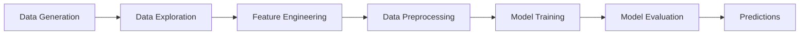

# 🏠 House Price Prediction Project

<div align="center">


*A comprehensive data science project demonstrating machine learning fundamentals*

[📋 Features](#-features) •
[🚀 Quick Start](#-quick-start) •
[📊 Results](#-results) •
[🛠️ Tech Stack](#️-tech-stack) •
[📚 Learning Outcomes](#-learning-outcomes)

</div>

---

## 📖 Overview

This project is a **complete end-to-end machine learning pipeline** for predicting house prices. It's specifically designed for **beginners** to learn the fundamentals of data science using Python's most popular libraries: **pandas**, **NumPy**, and **scikit-learn**.

### 🎯 What I Learn :
- Data generation and manipulation with **NumPy**
- Data analysis and visualization with **pandas**
- Machine learning workflows with **scikit-learn**
- Feature engineering and preprocessing techniques
- Model evaluation and comparison
- Best practices in data science

---

## ✨ Features

### 🔢 **Data Generation**
- Synthetic dataset creation using NumPy
- Realistic house features (bedrooms, bathrooms, square footage, age, location)
- Price calculation with location-based multipliers and noise

### 📊 **Exploratory Data Analysis**
- Comprehensive statistical summaries
- Interactive visualizations with matplotlib and seaborn
- Correlation analysis and pattern identification

### 🔧 **Feature Engineering**
- Price per square foot calculation
- Room total aggregation
- Binary indicators for new houses
- Log transformations for skewed data
- Categorical age groupings

### 🤖 **Machine Learning Models**
- **Linear Regression**: Baseline model with feature scaling
- **Random Forest**: Advanced ensemble method
- Model comparison and performance evaluation

### 📈 **Evaluation Metrics**
- Mean Absolute Error (MAE)
- Root Mean Square Error (RMSE)
- R² Score (Coefficient of Determination)
- Feature importance analysis

---

## 🚀 Quick Start

### Prerequisites

```bash
Python 3.7+
```

### Installation

1. **Clone the repository**
   ```bash
   git clone https://github.com/yourusername/house-price-prediction.git
   cd house-price-prediction
   ```

2. **Install required packages**
   ```bash
   pip install pandas numpy scikit-learn matplotlib seaborn
   ```

3. **Run the project**
   ```bash
   python house_price_prediction.py
   ```

### Alternative: One-line installation
```bash
pip install pandas numpy scikit-learn matplotlib seaborn && python house_price_prediction.py
```

---

## 📊 Results


### 🏆 Model Performance

| Model | MAE | RMSE | R² Score |
|-------|-----|------|----------|
| **Linear Regression** | $XX,XXX | $XX,XXX | 0.XXX |
| **Random Forest** | $XX,XXX | $XX,XXX | 0.XXX |

> *Note: Actual values will vary due to random data generation*

### 📈 Key Insights

1. **Square footage** is the most important predictor of house prices
2. **Location** significantly impacts property values (Downtown > Suburbs > Rural)
3. **Random Forest** typically outperforms Linear Regression for this dataset
4. **Feature engineering** improves model performance
5. **Age** has an inverse relationship with price

### 📸 Sample Visualizations

The project generates multiple visualizations including:
- Price distribution histograms
- Scatter plots for feature relationships
- Box plots for categorical comparisons
- Correlation heatmaps
- Feature importance charts

---

## 🛠️ Tech Stack

<div align="center">

| Category | Technologies |
|----------|--------------|
| **Language** |  |
| **Data Manipulation** |   |
| **Machine Learning** |  |
| **Visualization** |   |

</div>

### 🔧 Library Usage

#### **NumPy**
```python
# Random data generation
bedrooms = np.random.randint(1, 6, n_samples)
# Mathematical operations
price = sqft * 150 + np.random.normal(0, 15000, n_samples)
# Array operations
sqft = np.clip(sqft, 500, 5000)
```

#### **Pandas**
```python
# DataFrame creation and manipulation
df = pd.DataFrame({...})
# Feature engineering
df['price_per_sqft'] = df['price'] / df['sqft']
# Categorical encoding
df_encoded = pd.get_dummies(df, columns=['location'])
```

#### **Scikit-learn**
```python
# Train-test split
X_train, X_test, y_train, y_test = train_test_split(X, y, test_size=0.2)
# Model training
model = RandomForestRegressor(n_estimators=100)
model.fit(X_train, y_train)
# Evaluation
r2_score(y_test, predictions)
```

---

## 📚 Learning Outcomes

### 🎓 **Beginner Level**
- ✅ Understanding data structures (arrays, DataFrames)
- ✅ Basic data manipulation and cleaning
- ✅ Simple statistical analysis
- ✅ Data visualization fundamentals

### 🎓 **Intermediate Level**
- ✅ Feature engineering techniques
- ✅ Machine learning model training
- ✅ Model evaluation and comparison
- ✅ Cross-validation concepts

### 🎓 **Advanced Concepts**
- ✅ Pipeline optimization
- ✅ Feature importance analysis
- ✅ Hyperparameter tuning foundations
- ✅ Production-ready code structure

---

## 🔄 Project Workflow



### 📋 **13 Comprehensive Steps**

1. **📊 Data Generation** - Create synthetic dataset with NumPy
2. **📋 DataFrame Creation** - Structure data with pandas
3. **🔍 Exploratory Analysis** - Statistical summaries and insights
4. **📈 Data Visualization** - Multiple chart types for pattern recognition
5. **🔧 Feature Engineering** - Create meaningful derived features
6. **⚙️ Data Preprocessing** - Handle categorical variables and scaling
7. **🔄 Train-Test Split** - Proper data splitting for validation
8. **📏 Feature Scaling** - Standardization for algorithm optimization
9. **🤖 Model Training** - Train multiple algorithms
10. **📊 Model Evaluation** - Comprehensive performance metrics
11. **🎯 Feature Analysis** - Understand model decision-making
12. **🔮 Predictions** - Make predictions on new data
13. **📈 Final Comparison** - Model selection and insights

---

## 🤝 Contributing

Contributions are welcome! Here are some ways you can help:

- 🐛 **Bug Reports**: Found a bug? Let us know!
- ✨ **Feature Requests**: Have an idea? Share it!
- 📚 **Documentation**: Help improve our docs
- 🔧 **Code Improvements**: Submit a pull request

### Development Setup

1. Fork the repository
2. Create a feature branch: `git checkout -b feature-name`
3. Make your changes and test thoroughly
4. Submit a pull request with a clear description

---

## 📖 Resources

### 📚 **Documentation**
- [Pandas Documentation](https://pandas.pydata.org/docs/)
- [NumPy Documentation](https://numpy.org/doc/)
- [Scikit-learn Documentation](https://scikit-learn.org/stable/)

### 🎥 **Learning Materials**
- [Kaggle Learn](https://www.kaggle.com/learn) - Free data science courses
- [Real Python](https://realpython.com/) - Python tutorials
- [Coursera ML Course](https://www.coursera.org/learn/machine-learning) - Andrew Ng's course

### 📊 **Datasets for Practice**
- [Kaggle Datasets](https://www.kaggle.com/datasets)
- [UCI ML Repository](https://archive.ics.uci.edu/ml/index.php)
- [Google Dataset Search](https://datasetsearch.research.google.com/)

---

## 🙋‍♂️ Support

Having trouble? Here's how to get help:

- 📧 **Email**: veerababup114@gmail.com
- 💬 **Issues**: [Create an issue](https://github.com/veera1729/HOUSE_PRICE_PREDICTION_DATASCIENCE/issues)

---

## ⭐ Acknowledgments

- **NumPy Community** for the fundamental array computing library
- **Pandas Community** for the powerful data analysis tools
- **Scikit-learn Community** for the comprehensive ML library
- **Open Source Community** for making data science accessible to everyone

---

<div align="center">

**⭐ If this project helped you learn data science, please give it a star! ⭐**

Made with ❤️ for the data science community

[⬆ Back to Top](#-house-price-prediction-project)

</div>
